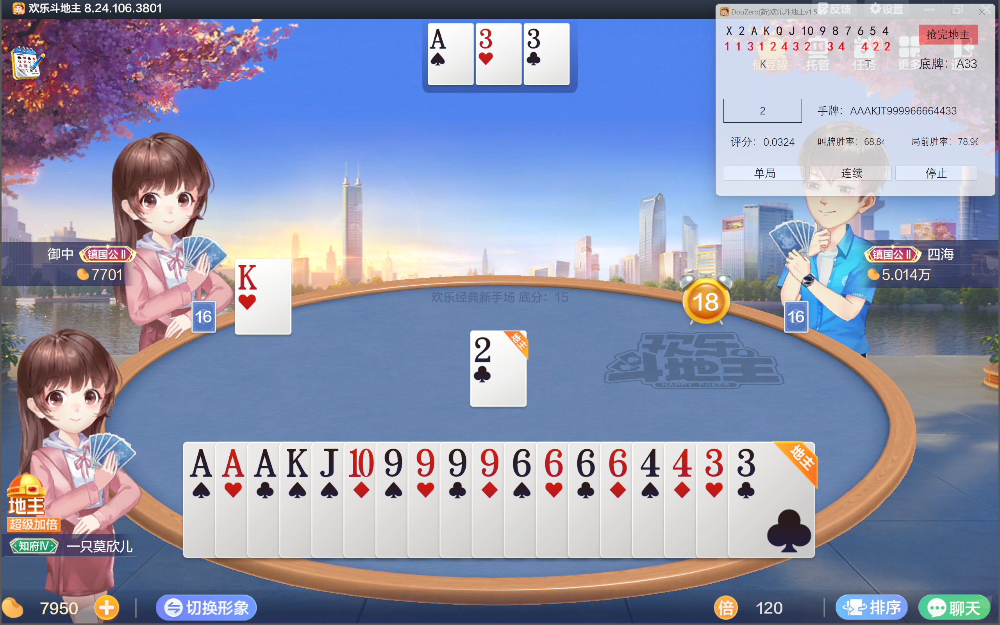

<p align="center">
  
</p>
  <h1 align="center">
  DouZero_For_HLDDZ_FullAuto
</h1>
<p align="center">
  将 DouZero 用于欢乐斗地主自动化
</p>
<p align="center">
  <a href="https://github.com/Vincentzyx/DouZero_For_HLDDZ_FullAuto/blob/main/LICENSE" target="_blank">
    
  </a>
    <a href="https://github.com/Vincentzyx/DouZero_For_HLDDZ_FullAuto" style="text-decoration:none">
    
  </a>
  <a herf="https://github.com/Vincentzyx/DouZero_For_HLDDZ_FullAuto/releases/lasted" style="text-decoration:none">
    
 </a>
<a style="text-decoration:none">
    
 </a>

</p>

## 截图



## 特性


- 本项目基于 [DouZero](https://github.com/kwai/DouZero) 和 [DouZero_For_Happy_DouDiZhu](https://github.com/tianqiraf/DouZero_For_HappyDouDiZhu)
- 在原 [DouZero_For_Happy_DouDiZhu](https://github.com/tianqiraf/DouZero_For_HappyDouDiZhu) 的基础上加入了自动出牌，基于手牌自动叫牌，加倍，同时修改截屏方式为窗口区域截屏，游戏原窗口遮挡不影响游戏进行。
- 感谢 girgle（QQ 群马云）对新版欢乐斗地主进行了适配，现在仓库代码已支持新版欢乐斗地主
- 感谢 Moxiner（一只莫欣儿）实现了用户友好的自定义截图引导界面同时完善了使用文档

## 演示视频

[点击此处 🎞️](https://www.bilibili.com/video/BV1Va4y1R7mR/)，前往 Bilibili 观看演示视频

## 安装与部属
#### 第一步 下载本项目及其向导程序
1. 点击此处下载本项目，您也可以执行此命令下载本项目
```
git clone https://github.com/Vincentzyx/DouZero_For_HLDDZ_FullAuto.git
```
2. 点击 [此处 ⬇️](https://github.com/Vincentzyx/DouZero_For_HLDDZ_FullAuto/releases) 下载向导程序
3. 下载完成后将向导程序移动到本项目根目录下
4. 打开向导程序

#### 第二步 安装运行环境
1. 下载 Python

   推荐使用 🐍 Python 3.8.10，您可以 [点击此处 ⬇️](https://www.python.org/ftp/python/3.8.10/python-3.8.10-amd64.exe) 下载，也可以点击向导程序中的 下载 Python 按钮。软件会唤醒浏览器进行下载

3. 安装 Python

   安装时请务必勾选 **add Python to PATH**

5. 安装 Python 第三方库

   点击向导软件中的 安装 Python 第三方库 按钮，等待脚本运行完成

#### 第三步 配置识图环境

##### 第一种方法
1. 点击 跳转至显示设置 按钮 会自动跳转至 显示设置 🖥️，将屏幕分辨率设置为以下任意一种参数
* 2560x1600
* 1920x1200
* 1680x1050
2. 点击游戏设置将游戏设置为全屏

##### 第二种方法
1. 使用向导软件的选区功能进行选取坐标

* 先预览并选择好下拉框中的选目
* 打开游戏，点击向导软件中的 截图 按钮
* 点击向导软件中的 截图 按钮，会弹出框选窗口，框选完成后关闭窗口完成本项目框选
* 完成所有项目框选

2. 导出 选区数据

* 点击 复制选区数据 按钮
* 点击 打开 main.py 按钮
* 替换合适的参数并保存 main.py

#### 关于模型
- 模型默认为 ADP，更换模型请修改 `main.py` 中的模型路径，如果需要加载 `Resnet` 新模型，请保证游戏路径或文件名中存在关键词 `resnet`

  ```python
  self.card_play_model_path_dict = {
      'landlord': "baselines/resnet_landlord.ckpt",
      'landlord_up': "baselines/resnet_landlord_up.ckpt",
      'landlord_down': "baselines/resnet_landlord_down.ckpt"
  }
  ```


####  第四步 运行主程序
- 运行 `main.py` 即可


## 说明

- 请勿把游戏界面**最小化**，否则无法使用
- 如果觉得这个项目有用，请给一个 **Star** 谢谢！
- 本项目仅供学习以及技术交流，请勿用于其它目的，否则**后果自负。**

## 文档

正在写，别急

## 自动叫牌/加倍原理

用 DouZero 自我博弈 N 局，对于随机到的每种手牌，随机生成若干种对手手牌，把该牌型和赢的局数扔进一个简单的全连接网络进行训练，得到手牌与胜率之间的关系，最后根据预期胜率，以一定阈值进行叫牌和加倍。

## 潜在 Bug

- 有较低几率把王炸识别为不出
- 安装第三方库脚本有概率安装失败

## 鸣谢

- 本项目基于[DouZero](https://github.com/kwai/DouZero) [DouZero_For_Happy_DouDiZhu](https://github.com/tianqiraf/DouZero_For_HappyDouDiZhu)

## 反馈
如果您在使用中有任何问题，您可以通过以下渠道反馈给我们
* 请翻阅 [Issues](https://github.com/Vincentzyx/DouZero_For_HLDDZ_FullAuto/issues) 是否有同样问题但已解决的办法
* QQ群：565142377 密码 douzero

欢迎加入 QQ 群交流自动化相关：565142377 密码 douzero

也可以在原作者[DouZero_For_Happy_DouDiZhu](https://github.com/tianqiraf/DouZero_For_HappyDouDiZhu) 的 QQ 群交流
